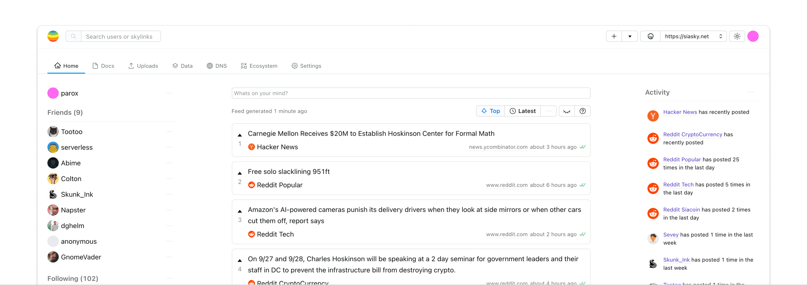

# rift

> Your personal **permissionless** and **encrypted** internet workspace.

## What

Rift is an app that aims to provide a decentralized alternative to the core Internet apps that we all depend on and use every day.

These apps include **social feeds, file sharing, document editing, search, video streaming**, developer tools for data and DNS, and more.

Think of Rift as an app that provides the productivity features of Google Docs and Dropbox and the social features of Facebook, Twitter, and YouTube ...but reimagined as software you control.

> Rift gives you control over _your_ data, algorithms, privacy!

## Quick Links

- [**Access**](#accessing-rift)
- [**About**](#about-rift)
- [**Features**](#features)
- [**Developers**](#developers)
- [**Roadmap**](#roadmap)

## Access Rift

#### Quick link

The Rift app can be accessed by navigating to [rift.sh](https://rift.sh) which redirects to siasky.net.

> [rift.sh](https://rift.sh)

#### Handshake

Alternatively, you can find Rift by visiting `riftapp.hns` on any Skynet Portal.

> https://riftapp.hns.siasky.net

#### Homescreen

Rift can also be accessed through [Skynet Homescreen](https://homescreen.hns.siasky.net/). Click the button below to add Rift to your Homescreen.

TODO add button

## About Rift

### Decentralized

Rift is built as a pure Skynet app, meaning its only dependency is access to the Skynet network. Rift can be accessed via any public or private Skynet Portal. It is important to note that Skynet Portals are entirely stateless and interchangeable. Any piece of data can be accessed from **_any_** Portal in under a few hundred milliseconds regardless of where on the network data was originally written or pinned. If you decide to stop using a specific Portal your data will be immediately available from any other Portal.

### Permissionless

When signed in to Rift with a [MySky](https://blog.sia.tech/mysky-your-home-on-the-global-operating-system-of-the-future-5a288f89825c) account, data is encrypted and stored in a personal filesystem on the Skynet network. Rift and Skynet are permissionless and self-sovereign - anyone can create an account (keypair), and only the key holder has the ability to access, decrypt, and modify data.

### Portable

In addition to storing all data in a private space, Rift runs on open data storage standards (DACs) for things like files, profiles, posts, feeds, and the social graph. This means with your permission, other applications can seamlessly access the exact same source data. This is important because it means your files and videos automatically move with you when you decide you like a different app for file sharing or video streaming.

### Fast

Skynet is very fast, any data can be accessed from anywhere on the network in under a few hundred milliseconds without caching, and writes propagate across the entire network within seconds. This means that files and media can be accessed and opened quickly in Rift, and videos can even be streamed.

## Features

### Omni-search

Rift omni-search is located on the main navbar and allows you to quickly access many useful functions. These include skylink and user lookup and will be expanded to include user files, registry entries, and more.

#### Skylink Lookup

Use Rift omni-search to look up a skylink and view metadata including skylink type, skyfile type, content-type, file size, and health status.

The Skylink context menu also includes many convenience functions for copying and formatting skylinks.

#### User search

Use Rift omni-search to find users. Search by username, first name, last name, location, about, user ID, or any other metadata. Rift user search does not call out to centralized servers or indexes - all results are found by indexing your social graph along with an initial seedlist of users. As you lookup and follow more users, the results will grow. There are also longer term plans to augment the search results with trustless external search indices.

### Home

Home is the social area of Rift. This is where you can view friends and followers, navigate to their profiles, browse aggregated social feeds, view a summary of general activity from across your social graph, and navigate to advanced features such as digging into your personal "top" feed's ranking algorithm.

#### Friends, Followers, and Suggestions

Followers are pulled directly from the Social DAC and the Rift Indexer computes friends whenever mutual follows exist. The suggested users are pulled from a seedlist of users.

#### Social Feeds

Rift currently includes latest and top feeds of aggregated content. The latest feed is a reverse chronological feed of all posts from users that you are following. The top feed is a ranked feed of content scored according to an algorithm explained in the [Algorithmic transparency](#algorithmic-transparency) section. The relevancy algorithm is sensitive to signals from past content interactions, your social graph, and recency. The algorithm is meant to be transparent and user controlled.

#### Activity

todo

#### Algorithmic transparency

todo
Besides custody of user data, another important aspect of user agency and self-sovereignty is transparency and control of the algorithms that process your data.

As explained in the [Social Feeds](#social-feeds) section ,Rift generates the top feeds by scoring and ranking posts from your social graph. The ranking algorithm (unfinished) takes into account a variety of signals such as who made a post, how many connecwhat concepts you commonly show interest in

### Files

> This feature is currently being refactored into a file system feature running on the Filesystem DAC, please note that the content below explains the current functionality.

todo

### Data

todo

### DNS

todo

### Ecosystem

todo

### Settings

todo

### Dev tools

todo

# Developers

todo

## Getting started

todo

## Codebase

todo

## Architecture

todo

## Dev tools

todo

### Task manager

### User indexing
