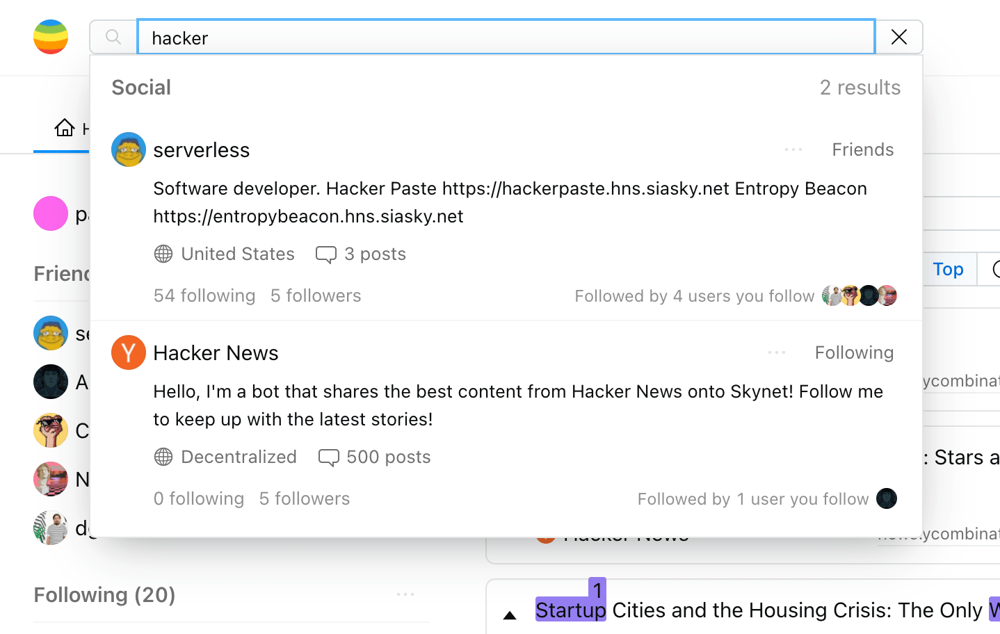

# rift

[![Add to Homescreen](https://img.shields.io/badge/Skynet-Add%20To%20Homescreen-00c65e?style=for-the-badge&labelColor=0d0d0d&logo=data:image/png;base64,iVBORw0KGgoAAAANSUhEUgAAACAAAAAbCAYAAAAdx42aAAAABGdBTUEAALGPC/xhBQAAACBjSFJNAAB6JgAAgIQAAPoAAACA6AAAdTAAAOpgAAA6mAAAF3CculE8AAAAeGVYSWZNTQAqAAAACAAFARIAAwAAAAEAAQAAARoABQAAAAEAAABKARsABQAAAAEAAABSASgAAwAAAAEAAgAAh2kABAAAAAEAAABaAAAAAAAAAEgAAAABAAAASAAAAAEAAqACAAQAAAABAAAAIKADAAQAAAABAAAAGwAAAADGhQ7VAAAACXBIWXMAAAsTAAALEwEAmpwYAAACZmlUWHRYTUw6Y29tLmFkb2JlLnhtcAAAAAAAPHg6eG1wbWV0YSB4bWxuczp4PSJhZG9iZTpuczptZXRhLyIgeDp4bXB0az0iWE1QIENvcmUgNi4wLjAiPgogICA8cmRmOlJERiB4bWxuczpyZGY9Imh0dHA6Ly93d3cudzMub3JnLzE5OTkvMDIvMjItcmRmLXN5bnRheC1ucyMiPgogICAgICA8cmRmOkRlc2NyaXB0aW9uIHJkZjphYm91dD0iIgogICAgICAgICAgICB4bWxuczp0aWZmPSJodHRwOi8vbnMuYWRvYmUuY29tL3RpZmYvMS4wLyIKICAgICAgICAgICAgeG1sbnM6ZXhpZj0iaHR0cDovL25zLmFkb2JlLmNvbS9leGlmLzEuMC8iPgogICAgICAgICA8dGlmZjpPcmllbnRhdGlvbj4xPC90aWZmOk9yaWVudGF0aW9uPgogICAgICAgICA8dGlmZjpSZXNvbHV0aW9uVW5pdD4yPC90aWZmOlJlc29sdXRpb25Vbml0PgogICAgICAgICA8ZXhpZjpQaXhlbFlEaW1lbnNpb24+NTM8L2V4aWY6UGl4ZWxZRGltZW5zaW9uPgogICAgICAgICA8ZXhpZjpQaXhlbFhEaW1lbnNpb24+NjQ8L2V4aWY6UGl4ZWxYRGltZW5zaW9uPgogICAgICAgICA8ZXhpZjpDb2xvclNwYWNlPjE8L2V4aWY6Q29sb3JTcGFjZT4KICAgICAgPC9yZGY6RGVzY3JpcHRpb24+CiAgIDwvcmRmOlJERj4KPC94OnhtcG1ldGE+Cnr0gvYAAAe5SURBVEgNlVYJbFzVFT3vL/Nt4yXOyiLahF24EMBrszqhNA1EpZWwK0qxZ2xk0apEpaJFNGkzRCC1VYlUJyoisj22EyrFlqBqaGgqiE0QxPaMSyi1E9JS0pRCwGRx7Njz5289702+lWArSZ8zkz/vv3vvufeee+8T+H9WT7WBVb2uEknVXw9XrENEWw6Bm5Hxr4bnz4IuxmHqHwHBu3D81xGYr6Cq5VMlE9ToEN3e+SbF+T8u+hwKD8SuhQjigKhFrp5Pw0CGOv0gAP9xX0CjWksHDA2wvc+51YqM+DWWtJ7E+U7I0xc1Gr4M4hpE3Ed//YPQtW3IMWZjNB1Q2oFpRJBDYz6Nu/zQJqMASD8nM9zgc5ElMOkeg+83oKLjdXQxErXZSFwaQHj4YOPj9GwLJh0a8tPINXMUviA4oEJtiEMQ+klGJwLH/RI0vZJpWAvLmIMztouIbihgtvcQlnT+PoxEFoD0RUDG78IVhivZ0Mhwt1AR403fCiIm0m4/Q76BHu3j3nRZqSn1vavgG+uZgifID4NR8glEYyRWUm6/jIRAqslE2Xa6xRV6K5/DsA/W3U6yDcILDBp0kR8x+LwVd7Wtl8doWmB7k4HiUz5qSgJ0DwnMKxGoHuKbc4RLNi6F8F8iiPmKH0I7gv9+Xob7/zgmsD82DznBQljeMBbvOKsMK82bqEAESEX3wtC/jnHHRlHEgu1uRVl71ngYIXV+hq8gEOiuNZnvDAaidzAFPSRlIQotjcR9ik78MpuCA9GFCLz76OFRLN35pylVAw21mGPtwvGzDolm0ts3UZZYwfcC8bj8yJRceg3VRFBCEIP1teTGLoIgWcW/6PTtmgrhV9uP4vSsFu7eTI8T6G8oU1p97Q2cSD8Pk9S2DJBcP1H7PXH9so1LAWlcRqu0o4uVsluVqCauQ8ZcwfIihDjL7N6tNpZ2biGIVkTwG7z7SAtOjzqoSPwAgbYEZzMbsff6pAKwKu4q4JInX1xyT/Lii2tkXpaoQmxjFYHNiqXrr7zwYE+cnY7KJaD7jz1PDnwHrtfMnP9C6ZOE9dKLyDwHlTs+nLLxdk0uNFZG1Ytnpvakjk0kJEhM2UPClWrKg595B3nGTeTBngsByEPZSpACAQZja5jubnLDIYN/isqOVqWnr24V336FzD6Mqp2vqbPJhuvgubfxnAthfIAl7YfV2fBLpqDgJqEq7q+xbvaRBzDhvjcdQFZAYKB+tepa8vdAbDfm563DyMQ7BLQB5W2vYs9DhZhtNDHY5eyOvTjhdmINq+jtugpKrCPARcg1jpBw+5Be1K8im9UNHKhrRlHOYzjr/Gc6gLDnpxq6oAUlmPDWYlnnMSSjD1O+g4ICo5k/09OnUdXeh75HFsDyfw5NW8Gg7YPjbEEZz8vyzvPr2Kq/hUAUM4ocTu4eHJ14CVfnbsZs6wmMOZ9OJ1HvSBZUxv2Yxm6Fpb2HwWgU5e07kPZvYTfsxdycb7CmDzAyu9iXC3Fn2w8Zzm8yOtfAMI8gFduPPHEnyjqew+LW5UhnHoXGP1NvxQ0FJ6HjUYxleDzInQ4A1dlAaeIjjPNQxs9HXiSBVP19WN55BK98eA9GJjdJirAx1VLZQRr8HTR/DItbamAHlaqBFUX2EuBxDrANnB+HCeRBfPJJEUn9JIF8QA5wWupD0wGMsIXKZRp/Z8uVdhwOGzkB7lb760ikisRmpmA1vTjEPOexT3wfuv4+gTwN3RhGadtKgvwafT6OK/OfQYH1GYF048r5y8grVlXiDtiZSkxMPDADB0gr2Rteq5uDIobfC66iR3LE/hunxhfjnu7RqflxuKEAY8E2vqtTtS3vABmflxH8CuWJbQpwdoRvxtzcG9jOOaKdvzH2L+L0+AtS13QAUiocSslYG1twjKTLzoG0sxHlHc8qAKUcPlPDRhG0me11lmqzBREg7R1C4MfpcZcCkow9TiI+ieKcBeoCM+mO8vzamQGEkzApS0rrYwpkWjSOUpvEqUYp2d/F/j5c4qpmI4H0P7yIfZ6AjWqmxuFtyOQzb0TuW5Ql8PZe9NTkoyB/E9PXhOLcQpxxvj0zAAk5LMdktAV5ZiNO2TYrwmJyPuPbNahoP6giVcNfg8Xa1EgfjP6MZfesVEHjLgksx7jk0h/geRsZkSH2mBL4uAZVHX+5CIBzXHjzu8W4Iqef6m7ktYogdItvTpOUj5GMO5Uh+RXOBdl2+6JVvKw2M9Tl9JadUWi4ghPNkawWz5GE2aEmB/6UgpkeQi6kordRUIaygDm2YQgrG16vl95uh+30Yp99AnFOvea1Fta/arONrybIXRw4c7MXVsjbtIlii/xwS3BXYljOnIsDkKDCATUQLWded9P4AvaHDA0LemUyGlLhKY7rf9AYicXce/5CVs+1NCzUJwg8Es5gY5NV8FuUJn7ElKhquzSA80G81fhltt0EvV/F/Eqms66YYCEiasbzuqfyLfuG4/OLd0BpOJ9VYXsTVPUUw98sVXJJ20R4uSskpTwvL6mB/2M2oFvP3f1p0KM6Bl36pTHn8gIjAaUdXvOCl8mHZ7Bs5/tZrsSl/7KyFAr5/+UtRbRzwnuY63kLZHe8lyAq6PFCNqM5LFabrfZjah7mXg8MYzdKW/+pDMxwh/wf4xZoOPPcKX0AAAAASUVORK5CYII=)](https://homeapp.hns.siasky.net/#/skylink/AQBLTOv9uMFcNR_NRooBc6Rv7jb4it1cozkWEApU3roLEQ)

> Your personal **permissionless** and **encrypted** internet workspace.

## What

Rift is an app that aims to provide a decentralized alternative to the core Internet apps we all use and depend on every day.

These apps include **social feeds, file sharing, document editing, search, video streaming**, developer tools for data and DNS, and more.

Think of Rift as an app that provides the productivity and social features of Google Docs, Dropbox, Facebook, Twitter, and YouTube ...but reimagined as software you control.

> Rift gives you control over _your_ data, algorithms, privacy!

## Quick Links

- [**Users**](#accessing-rift)
  - [**Access**](#accessing-rift)
  - [**About**](#about-rift)
  - [**Features**](#features)
- [**Developers**](#developers)
  - [**Overview**](#overview)
  - [**Architecture**](#architecture)
  - [**Dev tools**](#dev-tools)
- [**Roadmap**](#roadmap)

## Access Rift

#### Quick link

The Rift app can be accessed by navigating to [rift.sh](https://rift.sh) which redirects to siasky.net.

> [rift.sh](https://rift.sh)

#### Handshake

Alternatively, you can find Rift by visiting `riftapp.hns` on any Skynet Portal.

> https://riftapp.hns.siasky.net

#### Homescreen

Rift can also be accessed through [Skynet Homescreen](https://homescreen.hns.siasky.net/). Click the button below to add Rift to your Homescreen.

> [![Add to Homescreen](https://img.shields.io/badge/Skynet-Add%20To%20Homescreen-00c65e?style=for-the-badge&labelColor=0d0d0d&logo=data:image/png;base64,iVBORw0KGgoAAAANSUhEUgAAACAAAAAbCAYAAAAdx42aAAAABGdBTUEAALGPC/xhBQAAACBjSFJNAAB6JgAAgIQAAPoAAACA6AAAdTAAAOpgAAA6mAAAF3CculE8AAAAeGVYSWZNTQAqAAAACAAFARIAAwAAAAEAAQAAARoABQAAAAEAAABKARsABQAAAAEAAABSASgAAwAAAAEAAgAAh2kABAAAAAEAAABaAAAAAAAAAEgAAAABAAAASAAAAAEAAqACAAQAAAABAAAAIKADAAQAAAABAAAAGwAAAADGhQ7VAAAACXBIWXMAAAsTAAALEwEAmpwYAAACZmlUWHRYTUw6Y29tLmFkb2JlLnhtcAAAAAAAPHg6eG1wbWV0YSB4bWxuczp4PSJhZG9iZTpuczptZXRhLyIgeDp4bXB0az0iWE1QIENvcmUgNi4wLjAiPgogICA8cmRmOlJERiB4bWxuczpyZGY9Imh0dHA6Ly93d3cudzMub3JnLzE5OTkvMDIvMjItcmRmLXN5bnRheC1ucyMiPgogICAgICA8cmRmOkRlc2NyaXB0aW9uIHJkZjphYm91dD0iIgogICAgICAgICAgICB4bWxuczp0aWZmPSJodHRwOi8vbnMuYWRvYmUuY29tL3RpZmYvMS4wLyIKICAgICAgICAgICAgeG1sbnM6ZXhpZj0iaHR0cDovL25zLmFkb2JlLmNvbS9leGlmLzEuMC8iPgogICAgICAgICA8dGlmZjpPcmllbnRhdGlvbj4xPC90aWZmOk9yaWVudGF0aW9uPgogICAgICAgICA8dGlmZjpSZXNvbHV0aW9uVW5pdD4yPC90aWZmOlJlc29sdXRpb25Vbml0PgogICAgICAgICA8ZXhpZjpQaXhlbFlEaW1lbnNpb24+NTM8L2V4aWY6UGl4ZWxZRGltZW5zaW9uPgogICAgICAgICA8ZXhpZjpQaXhlbFhEaW1lbnNpb24+NjQ8L2V4aWY6UGl4ZWxYRGltZW5zaW9uPgogICAgICAgICA8ZXhpZjpDb2xvclNwYWNlPjE8L2V4aWY6Q29sb3JTcGFjZT4KICAgICAgPC9yZGY6RGVzY3JpcHRpb24+CiAgIDwvcmRmOlJERj4KPC94OnhtcG1ldGE+Cnr0gvYAAAe5SURBVEgNlVYJbFzVFT3vL/Nt4yXOyiLahF24EMBrszqhNA1EpZWwK0qxZ2xk0apEpaJFNGkzRCC1VYlUJyoisj22EyrFlqBqaGgqiE0QxPaMSyi1E9JS0pRCwGRx7Njz5289702+lWArSZ8zkz/vv3vvufeee+8T+H9WT7WBVb2uEknVXw9XrENEWw6Bm5Hxr4bnz4IuxmHqHwHBu3D81xGYr6Cq5VMlE9ToEN3e+SbF+T8u+hwKD8SuhQjigKhFrp5Pw0CGOv0gAP9xX0CjWksHDA2wvc+51YqM+DWWtJ7E+U7I0xc1Gr4M4hpE3Ed//YPQtW3IMWZjNB1Q2oFpRJBDYz6Nu/zQJqMASD8nM9zgc5ElMOkeg+83oKLjdXQxErXZSFwaQHj4YOPj9GwLJh0a8tPINXMUviA4oEJtiEMQ+klGJwLH/RI0vZJpWAvLmIMztouIbihgtvcQlnT+PoxEFoD0RUDG78IVhivZ0Mhwt1AR403fCiIm0m4/Q76BHu3j3nRZqSn1vavgG+uZgifID4NR8glEYyRWUm6/jIRAqslE2Xa6xRV6K5/DsA/W3U6yDcILDBp0kR8x+LwVd7Wtl8doWmB7k4HiUz5qSgJ0DwnMKxGoHuKbc4RLNi6F8F8iiPmKH0I7gv9+Xob7/zgmsD82DznBQljeMBbvOKsMK82bqEAESEX3wtC/jnHHRlHEgu1uRVl71ngYIXV+hq8gEOiuNZnvDAaidzAFPSRlIQotjcR9ik78MpuCA9GFCLz76OFRLN35pylVAw21mGPtwvGzDolm0ts3UZZYwfcC8bj8yJRceg3VRFBCEIP1teTGLoIgWcW/6PTtmgrhV9uP4vSsFu7eTI8T6G8oU1p97Q2cSD8Pk9S2DJBcP1H7PXH9so1LAWlcRqu0o4uVsluVqCauQ8ZcwfIihDjL7N6tNpZ2biGIVkTwG7z7SAtOjzqoSPwAgbYEZzMbsff6pAKwKu4q4JInX1xyT/Lii2tkXpaoQmxjFYHNiqXrr7zwYE+cnY7KJaD7jz1PDnwHrtfMnP9C6ZOE9dKLyDwHlTs+nLLxdk0uNFZG1Ytnpvakjk0kJEhM2UPClWrKg595B3nGTeTBngsByEPZSpACAQZja5jubnLDIYN/isqOVqWnr24V336FzD6Mqp2vqbPJhuvgubfxnAthfIAl7YfV2fBLpqDgJqEq7q+xbvaRBzDhvjcdQFZAYKB+tepa8vdAbDfm563DyMQ7BLQB5W2vYs9DhZhtNDHY5eyOvTjhdmINq+jtugpKrCPARcg1jpBw+5Be1K8im9UNHKhrRlHOYzjr/Gc6gLDnpxq6oAUlmPDWYlnnMSSjD1O+g4ICo5k/09OnUdXeh75HFsDyfw5NW8Gg7YPjbEEZz8vyzvPr2Kq/hUAUM4ocTu4eHJ14CVfnbsZs6wmMOZ9OJ1HvSBZUxv2Yxm6Fpb2HwWgU5e07kPZvYTfsxdycb7CmDzAyu9iXC3Fn2w8Zzm8yOtfAMI8gFduPPHEnyjqew+LW5UhnHoXGP1NvxQ0FJ6HjUYxleDzInQ4A1dlAaeIjjPNQxs9HXiSBVP19WN55BK98eA9GJjdJirAx1VLZQRr8HTR/DItbamAHlaqBFUX2EuBxDrANnB+HCeRBfPJJEUn9JIF8QA5wWupD0wGMsIXKZRp/Z8uVdhwOGzkB7lb760ikisRmpmA1vTjEPOexT3wfuv4+gTwN3RhGadtKgvwafT6OK/OfQYH1GYF048r5y8grVlXiDtiZSkxMPDADB0gr2Rteq5uDIobfC66iR3LE/hunxhfjnu7RqflxuKEAY8E2vqtTtS3vABmflxH8CuWJbQpwdoRvxtzcG9jOOaKdvzH2L+L0+AtS13QAUiocSslYG1twjKTLzoG0sxHlHc8qAKUcPlPDRhG0me11lmqzBREg7R1C4MfpcZcCkow9TiI+ieKcBeoCM+mO8vzamQGEkzApS0rrYwpkWjSOUpvEqUYp2d/F/j5c4qpmI4H0P7yIfZ6AjWqmxuFtyOQzb0TuW5Ql8PZe9NTkoyB/E9PXhOLcQpxxvj0zAAk5LMdktAV5ZiNO2TYrwmJyPuPbNahoP6giVcNfg8Xa1EgfjP6MZfesVEHjLgksx7jk0h/geRsZkSH2mBL4uAZVHX+5CIBzXHjzu8W4Iqef6m7ktYogdItvTpOUj5GMO5Uh+RXOBdl2+6JVvKw2M9Tl9JadUWi4ghPNkawWz5GE2aEmB/6UgpkeQi6kordRUIaygDm2YQgrG16vl95uh+30Yp99AnFOvea1Fta/arONrybIXRw4c7MXVsjbtIlii/xwS3BXYljOnIsDkKDCATUQLWded9P4AvaHDA0LemUyGlLhKY7rf9AYicXce/5CVs+1NCzUJwg8Es5gY5NV8FuUJn7ElKhquzSA80G81fhltt0EvV/F/Eqms66YYCEiasbzuqfyLfuG4/OLd0BpOJ9VYXsTVPUUw98sVXJJ20R4uSskpTwvL6mB/2M2oFvP3f1p0KM6Bl36pTHn8gIjAaUdXvOCl8mHZ7Bs5/tZrsSl/7KyFAr5/+UtRbRzwnuY63kLZHe8lyAq6PFCNqM5LFabrfZjah7mXg8MYzdKW/+pDMxwh/wf4xZoOPPcKX0AAAAASUVORK5CYII=)](https://homeapp.hns.siasky.net/#/skylink/AQBLTOv9uMFcNR_NRooBc6Rv7jb4it1cozkWEApU3roLEQ)

## About Rift

### Decentralized

Rift is built as a pure Skynet app, meaning its only dependency is access to the Skynet network. Rift can be accessed via any public or private Skynet Portal. It is important to note that Skynet Portals are entirely stateless and interchangeable. Any piece of data can be accessed from **_any_** Portal in under a few hundred milliseconds regardless of where on the network data was originally written or pinned. If you decide to stop using a specific Portal your data will be immediately available from any other Portal.

### Permissionless

When signed in to Rift with a [MySky](https://blog.sia.tech/mysky-your-home-on-the-global-operating-system-of-the-future-5a288f89825c) account, data is encrypted and stored in a personal filesystem on the Skynet network. Rift and Skynet are permissionless and self-sovereign - anyone can create an account (keypair), and only the key holder has the ability to access, decrypt, and modify data.

### Open

In addition to storing all data in a private space, Rift runs on open data storage standards (DACs) for things like files, profiles, posts, feeds, and the social graph. This means with your permission, other applications can seamlessly access the exact same source data. This is important because it means your files and videos automatically move with you when you decide you like a different app for file sharing or video streaming.

### Fast

For a decentralized network, Skynet is very fast. Any data can be accessed from anywhere on the network in under a few hundred milliseconds without caching, and writes propagate across the entire network within seconds. This means that files and media can be accessed and opened quickly in Rift, and videos can even be streamed.

## Features

### Omni-search

Rift omni-search is located on the main navbar and allows you to quickly access many useful functions. These include user search, user and skylink lookup, and will be expanded to include user files, registry entries, and more.

#### User search

Use Rift omni-search to find users. Search by username, first name, last name, location, about, user ID, or any other metadata. Rift user search does not call out to centralized servers or indexes - all results are found by indexing your social graph along with an initial seedlist of users. As you lookup and follow more users, the results will grow. There are also longer term plans to augment the search results with trustless external search indices.

#### Skylink Lookup

Use Rift omni-search to look up a skylink and view metadata including skylink type, skyfile type, content-type, file size, and health status.

The Skylink context menu also includes many convenience functions for copying and formatting skylinks.

### Home

Home is the social area of Rift. This is where you can view friends and followers, navigate to their profiles, discover other users, browse your social feeds, view a summary of activity from across your social graph, and navigate to advanced features such as digging into your personal "top" feed's ranking algorithm.

#### Friends, Followers, and Suggestions

Followers are pulled directly from the Social DAC and the Rift Indexer computes friends whenever mutual follows exist. The suggested users are pulled from a seedlist of users.

#### Social Feeds

Rift currently includes latest and top feeds of aggregated content. The latest feed is a reverse chronological feed of all posts from users that you are following. The top feed is a ranked feed of content scored according to an algorithm explained in the [Algorithmic transparency](#algorithmic-transparency) section. The relevancy algorithm is sensitive to signals from past content interactions, your social graph, and recency. The algorithm is meant to be transparent and user controlled.

#### Activity

todo

#### Algorithmic transparency

todo
Besides custody of user data, another important aspect of user agency and self-sovereignty is transparency and control of the algorithms that process your data.

As explained in the [Social Feeds](#social-feeds) section ,Rift generates the top feeds by scoring and ranking posts from your social graph. The ranking algorithm (unfinished) takes into account a variety of signals such as who made a post, how many connecwhat concepts you commonly show interest in

### Files

> This feature is currently being refactored into a file system feature running on the Filesystem DAC, please note that the content below explains the current functionality.

todo

### Data

todo

### DNS

todo

### Ecosystem

todo

### Settings

todo

### Dev tools

todo

# Developers

todo

## Overview

The Rift project is set up as a monorepo broken into libraries.

### Apps

- **@riftdweb/app** The core Rift web application

### Packages

- **@riftdweb/design-system** Design-system and component library
- **@riftdweb/queue** Custom task processing library necessary for the core Rift indexing services
- **@riftdweb/logger** Custom logger with name-spaced logging and workflow tracing
- **@riftdweb/types** Library of common types used across all Rift libraries
- **@riftdweb/skynet-js-iso** Unstable fork of skynet-js modified to be isomorphic and work with nodejs

### Services

- **@riftdweb/bots** Bot that mirrors arbitrary RSS feeds onto the Feed DAC, triggered by Github Action

## Complexity

Skynet applications follow a new paradigm. Although they can be built with familiar web technologies, they require a very different approach from traditional stateless client-server architectures. The approach is more similar to building peer-to-peer software, requiring significant local state and processing. Because there are no centralized servers on Skynet, data is partitioned by user across the network and client applications must handle all data indexing, transformation, and transactions. This results in difficulties around data access, data synchronization and consistency, transactional race conditions, and a very different latency profile.

## Architecture

Rift is a web application built on top of a specialized indexing system. The indexer is built to schedule, prioritize, and queue tasks necessary to keep data synchronized. Rift's prioritization scheme is built on a custom task processing library that supports queuing, pooling, prioritization lanes, and rate limiting. With an endless supply of indexing, rate limiting is an important aspect of not overwhelming Portals and triggering throttling which would drastically slow down the indexing process. The generated indices are stored on Skynet so that they can be persisted and shared across sessions and clients.

#### Prioritization and responsive UX

Rift must index data such as profiles, followers, social graphs, social feeds, and files from across hundreds of users. Initializing this data can take minutes to hours and keeping it up-to-date is a continuous process. Therefore Rift adjusts data expiry and prioritizes units of work, or tasks, based on how the user interacts with Rift features. Indexing and layered caching is critical for hiding latency and ensuring recent data is always available to support fast load times and a responsive user experience. Rift uses a custom task processing system explained below.

#### Prioritization levels

| Priority | Description                                                                                         |
| -------- | --------------------------------------------------------------------------------------------------- |
| 0        | Low priority indexing lane for data from unfamiliar users that is not on screen                     |
| 1        | Indexing lane for data from familiar users that are not on screen                                   |
| 2        | Rendering lane for data that appears on screen                                                      |
| 3        | High priority indexing required for subsequent interaction                                          |
| 4        | Indexing lane for data that the user is interacting with or has actively requested to be re-indexed |

Below are two tables that demonstrate how some of the Rift internal functions prioritize and schedule specific user data for re-indexing. Beyond user data, prioritization and scheduling is also used for all other internal workflows such as aggregating feeds, activity, and reading and writing all data.

#### Prioritization and data expiry for familiar users

| Operation | Priority | Profile   | Following | Meta      | Feed       |
| --------- | -------- | --------- | --------- | --------- | ---------- |
| Index     | 0        | 2 days    | 2 days    | 2 days    | 1 hour     |
| Render    | 2        | 2 days    | 2 days    | 2 days    | 20 minutes |
| Interact  | 4        | 2 minutes | 2 minutes | 2 minutes | 2 minutes  |
| Get       | 0        | 2 minutes | 2 minutes | 2 minutes | Never      |
| Refresh   | 0        | Force     | Force     | Force     | Force      |

#### Prioritization and data expiry for unfamiliar users

| Operation | Priority | Profile   | Following | Meta      | Feed      |
| --------- | -------- | --------- | --------- | --------- | --------- |
| Index     | 0        | 2 days    | 2 days    | 2 days    | Never     |
| Render    | 2        | 2 days    | 2 days    | 2 days    | Never     |
| Interact  | 4        | 2 minutes | 2 minutes | 2 minutes | 2 minutes |
| Get       | 0        | 2 minutes | 2 minutes | Never     | Never     |
| Refresh   | 0        | Force     | Force     | Force     | Force     |

#### Eventual consistency

The goal of the Rift indexer is to provide eventual consistency, where the prioritization and expiration strategy supports a user experience where data is passively re-indexed ahead of probable interactions, upon interaction a "stale-while-revalidate" pattern leverages mostly-recent data while asynchronously re-indexing, and things gracefully fallback to wait for indexing when the accessed resource is completely new.

#### Long-running cancelable workflows

The indexer is built from long-running workflows that fetch, transform, and cache data both locally and on the network. These workflows can take significant time and sometime must be paused, re-scheduled, or canceled. To achieve this functionality, all of these workflows are written as "cancelable async flows" using generators orchestrated with a runner. Each workflow is initialized with a token that can be used to cancel and clean up a task mid-workflow.

#### Task queueing, pooling, and rate limiting

The described task processing leverages a custom library that supports queueing tasks, prioritizing tasks, sharing identical tasks and raising priority, and dropping tasks. The library includes a TaskQueue mode that leverages a queue and pool size for configuring concurrency.

The library also includes a separate RateLimiter mode for that employs a modified "leaky bucket" algorithm with a configurable burst and bucket size where overflow goes into a queue. Rift uses the RateLimiter to keep Portal requests within server-side rate limits to avoid getting throttled while maximizing requests per minute.

#### Simulated locking, transactions, and safe updates

Skynet data can be updated by any client application with the correct permissions. The only mechanism protecting data from race conditions and potential corruption or loss is an incremented revision number. Although there are plans to add more client-side safety to skynet-js for checking that revision numbers are incremented on any update, Rift also leverages queueing to ensure data is locked for updates that transform common data. Rift does this by modeling all updates to a specific resource as encapsulated transactions (tasks) that are processed with a TaskQueue configured to process each task sequentially with no parallelism. This pattern abstracts away dealing with race conditions locally and allows tasks to be re-run when they fail to compete with updates originating externally, from outside of Rift.

## Internal dev tools

To support development using the above patterns, Rift includes a few developer tools for introspecting indexing and task management.

### Task manager

The task manager shows all active queues and their pending and queued tasks. The tasks show their metadata, priority, a count of how many consumers are waiting, and more.

### User indexing

The user indexing tool shows the status of every known user and the expiry status of each user's data resources, based on passive prioritization. When a user is begins processing, the status will change to pending (red), and the internal tasks will show up in the task manager.

## Goals

### Short term

- Create best-in-class interfaces for common social, productivity, and developer functionality on Skynet.
- Extract the core Rift indexer into a Skynet Kernel module so all apps can tap into and share a single indexing process.
- Showcase what is possible on Skynet without centralized dependencies.

### Long-term

- Gradually turn Rift into a decentralized Notion, where users can share files and and collaborate on structured and nested documents across their social graph ...a decentralized and collaborative knowledge graph ...a decentralized Internet!
